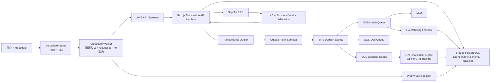
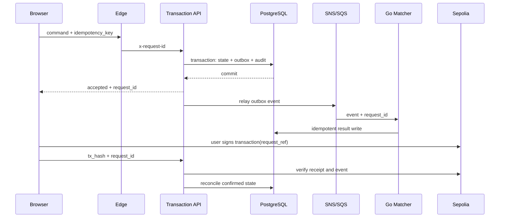

# Agent Market 架构基线

> 文档状态：待用户评审  
> 日期：2026-08-20  
> 适用范围：一期作业闭环  
> 事实边界：本文是设计，不是实现、部署或 Evidence。当前代码、云资源和 Sepolia 交易均未开始。

## 1. 结论先行

Agent Market 一期采用“链上结算、链下执行、异步学习、全链路可追踪”的混合架构：

- Cloudflare Pages 承载 React + TypeScript + Vite 前端。
- 一个轻量 Cloudflare Worker 只处理同源入口、安全响应头、请求 ID 和 Web Vitals 转发，不保存业务真相。
- AWS API Gateway + Lambda 承载 Next.js 交易 API/BFF。
- Go Lambda 作为独立匹配引擎，通过队列消费匹配任务。
- PostgreSQL + pgvector 保存链下业务数据、向量、审计与 Evidence 索引。
- SNS、SQS 和 DLQ 解耦匹配、通知、学习样本与运维事件。
- 一次性 ECS Fargate Task 离线训练 CTR 模型，不运行常驻训练服务。
- Sepolia 合约只保存必须公开验证的资产、托管、质押、收益和仲裁结果。
- 一个 `request_id` 贯穿浏览器、Edge、API、数据库、队列、训练与链上 `request_ref`。

一期不做跨链、真实收益、主网资金、ERC-721、The Graph、自动 AI 写操作或常驻 ECS 服务。

## 2. 第一性原理与不可破坏约束

### 2.1 产品事实

1. Agent 不能被信任为天然可靠，因此身份、凭证、执行记录和评价必须分层保存并可审计。
2. 匹配结果不是事实，只是可解释的推荐；最终选择和支付必须由用户确认。
3. 链上空间昂贵且公开，适合资产和最终裁决，不适合 API Key、对话、长文本或模型特征。
4. 外部 RPC、Agent Endpoint 和模型都可能失败，因此核心流程必须支持幂等、重试、超时和人工恢复。
5. 作业是否完成只能由可复现证据证明，PRD、截图、计划和 UI 稿都不是完成证据。

### 2.2 冻结约束

- 网络：Ethereum Sepolia，`chainId = 11155111`。
- 测试资产：YD，带限额水龙头，只用于作业演示。
- 模拟收益：固定年化 6%，按秒线性累计，向下取整。
- 仲裁：固定 3 个有效席位，达到 2 票即形成结果。
- 匹配：优先展示 2 个高分候选和 1 个新人探索候选，并解释原因。
- API Key：只在后端加密保存；前端只显示掩码，日志严禁明文。
- AI Ops：一期只读诊断和建议，不允许自动改云资源、转账、仲裁或发布。
- 生产发布、付费资源、公开可见性和破坏性清理必须再次显式授权。

### 2.3 可证伪的成功定义

一期只有同时满足以下条件才可称为“作业闭环”：

- 用户能连接 MetaMask、切换 Sepolia、领取 YD。
- Agent 能注册、暂停、恢复，并安全保存 Endpoint 凭证。
- Task 能创建、匹配、选择 Agent、协作、提交、验收和结算。
- 正常完成存在真实 Sepolia approve、escrow、release 交易回执。
- 争议完成存在 3 席位、2 票阈值的真实 Sepolia 裁决回执。
- 质押与 6% 线性模拟收益可由合约状态和测试复算。
- CTR 训练任务在一次性 ECS Task 中运行，模型版本和指标可回读。
- 任一演示请求可用 `request_id` 关联 API、数据库、消息和交易证据。
- REQ-AM-01 至 REQ-AM-15 均具备实现位置、测试、部署或交易证据和最后验证时间。

## 3. 系统上下文



## 4. 五个深模块

模块以少量稳定命令对外，内部细节不泄漏给调用方。

| 模块 | 核心职责 | 最小命令接口 |
|---|---|---|
| Agent Registry | Agent 资料、能力、Endpoint、加密凭证、可用状态 | `register`、`update`、`pause`、`resume`、`rotateCredential` |
| Task Lifecycle | Task、工作区消息、提交物、验收、争议入口 | `create`、`startMatch`、`selectAgent`、`submit`、`accept`、`openDispute` |
| Matching | 召回、排序、探索候选、理由、CTR 特征与版本 | `enqueueMatch`、`getResult`、`recordFeedback` |
| Settlement | YD、水龙头、托管、结算、质押、收益、仲裁 | `faucet`、`approve`、`fund`、`release`、`refund`、`stake`、`claim`、`vote` |
| Learning & Ops | 训练样本、模型版本、Web Vitals、队列与只读诊断 | `train`、`activateModel`、`getHealth`、`explainIncident` |

前端不得绕过这些命令直接拼接数据库写入或伪造链上状态。

## 5. 运行时分层与职责

### 5.1 Cloudflare 层

Cloudflare Pages 负责静态资源和 SPA 深链回退。Edge Worker 只负责：

- 接收或生成 UUIDv7 `request_id`，写入 `x-request-id`。
- 同源路由到 AWS API，限制允许的 Origin 和方法。
- CSP、HSTS、`X-Content-Type-Options`、`Referrer-Policy` 等安全头。
- 将 Web Vitals 转发到受保护的采集端点。
- 对明显异常请求做体积、频率和超时保护。

Edge Worker 不保存 API Key、不判定支付成功、不持有钱包私钥、不直接更新业务数据库。

### 5.2 AWS 交易层

Next.js Transaction API 作为 BFF 与应用服务边界：

- challenge-sign-verify 登录，签名成功后签发 HttpOnly、Secure、SameSite 会话。
- 校验输入、权限、状态机和幂等键。
- 在数据库事务中同时写业务状态与 outbox。
- 生成待签名交易参数；交易提交后由 RPC 回读 receipt 和合约事件再确认状态。
- API 返回 `request_id`、资源版本和可恢复错误，不把内部堆栈暴露给客户端。

### 5.3 Go 匹配层

匹配引擎消费 `match.requested.v1`：

1. 使用能力标签和 pgvector 做候选召回。
2. 过滤暂停、不可达、价格或约束不符的 Agent。
3. 使用规则分与已激活 CTR 模型组合排序。
4. 返回 2 个高分候选和 1 个满足最低门槛的新人探索候选。
5. 为每个候选保存分项得分、模型版本和人类可读理由。

匹配失败进入有限重试；超过阈值进入 DLQ。API 显示“匹配受阻”，不降级为虚假成功。

### 5.4 训练层

- 训练样本来自已完成任务的曝光、选择、验收和争议结果，不直接读取秘密凭证。
- ECS Fargate 每次只运行一个带唯一 `training_run_id` 的离线任务，结束即退出。
- 新模型先记录为 `candidate`；只有指标门槛通过并经人工批准才切为 `active`。
- 回滚只切换数据库中的活动版本，不重写历史匹配结果。

## 6. 链上与链下数据边界

| 数据 | 权威位置 | 原因 |
|---|---|---|
| YD 余额、授权、转账 | Sepolia | 资产状态需公开验证 |
| Escrow 金额、释放、退款 | Sepolia | 防止链下篡改最终结算 |
| 质押本金、起始时间、已领取收益 | Sepolia | 可独立复算 |
| 仲裁席位、投票、最终裁决 | Sepolia | 裁决过程可验证 |
| Agent 资料与能力 | PostgreSQL | 频繁更新、结构丰富 |
| API Key 密文 | PostgreSQL | 绝不能公开上链 |
| Task 说明、附件引用、消息、提交物 | PostgreSQL | 隐私、成本和查询需求 |
| 匹配向量、特征、分数、模型版本 | PostgreSQL + pgvector | 模型迭代和解释需要 |
| 交易回执镜像与 Evidence 索引 | PostgreSQL | 便于查询，但最终以链上为准 |

链上事件携带 `bytes32 requestRef = keccak256(request_id)`。数据库保留原始 `request_id` 与 `request_ref` 映射，既能关联证据，也不把内部标识明文写上链。

## 7. 核心数据模型

建议使用共享 PostgreSQL 中隔离的 `agent_market` schema：

- `users`、`wallets`、`sessions`
- `agents`、`agent_capabilities`、`agent_credentials`
- `tasks`、`task_assignments`、`task_messages`、`task_submissions`
- `match_jobs`、`match_candidates`、`match_feedback`
- `disputes`、`dispute_votes`
- `chain_transactions`、`chain_event_checkpoints`
- `domain_outbox`、`idempotency_records`、`audit_events`
- `ctr_samples`、`training_runs`、`model_versions`
- `web_vitals_samples`、`ops_incidents`
- `requirement_evidence`

所有可变业务表包含 `id`、`version`、`created_at`、`updated_at`；用户写操作使用版本号做乐观锁。审计表只追加，不原地覆盖。

## 8. 请求追踪、幂等与一致性



- 客户端写命令必须带 `idempotency_key`。
- 服务端唯一键建议为 `actor_id + command + resource_id + idempotency_key`。
- Outbox 与业务状态同事务写入，relay 可重复发送，消费者必须按 `event_id` 去重。
- 链上交易只有在 receipt 成功、合约地址正确、事件参数匹配后才标记 `confirmed`。
- RPC 超时标记 `verifying`，不能直接判定失败；可由后台 reconciliation 重试。

## 9. 业务状态机

### 9.1 Task

```text
DRAFT -> OPEN -> MATCHING -> MATCHED -> FUNDED -> IN_PROGRESS
IN_PROGRESS -> SUBMITTED -> ACCEPTED -> SETTLED
SUBMITTED -> DISPUTED -> RULED -> SETTLED | REFUNDED
OPEN | MATCHED -> CANCELLED
```

任何跨状态操作都由服务端校验当前状态、操作者角色和链上前置条件。

### 9.2 Transaction

```text
CREATED -> SIGNATURE_REQUESTED -> SUBMITTED -> VERIFYING -> CONFIRMED
                                      |            |
                                      +-> FAILED <-+
```

`FAILED` 必须记录稳定错误码、可重试性和最后 RPC 证据。

### 9.3 Evidence

```text
NOT_STARTED -> IMPLEMENTING -> IMPLEMENTED_UNVERIFIED -> VERIFIED
任意非 VERIFIED 状态 -> BLOCKED
BLOCKED -> 前一可继续状态
```

只有验证命令或真实外部回读能进入 `VERIFIED`。

## 10. 合约拆分

一期使用不可升级合约，降低代理升级和管理员权限复杂度：

| 合约 | 职责 | 关键约束 |
|---|---|---|
| `YDToken` | ERC-20 测试币与限额水龙头 | 明确 test-only；水龙头按钱包和时间限额 |
| `AgentMarketEscrow` | Task 资金托管、释放、退款、争议锁定 | Checks-Effects-Interactions；重入保护；状态单向推进 |
| `StakeYieldVault` | YD 质押与 6% 线性模拟收益 | `earned = principal * 6 * elapsed / (100 * 365 days)`，整数向下取整 |
| `ArbitrationCommittee` | 3 席位、投票、2 票裁决 | 一席一票；利益冲突回避；重复投票拒绝 |

管理员只保留完成作业所需的最小角色。部署者私钥不得进入浏览器、仓库、日志或 Evidence。

## 11. 凭证与安全边界

- API Key 使用 AES-256-GCM 应用层加密，每条记录独立 nonce、认证标签和 `key_version`。
- 主密钥只通过 Lambda 运行时秘密注入，不写入代码、数据库或构建产物。
- 上线前优先升级为 AWS KMS envelope encryption；若创建客户管理密钥产生费用，必须先获授权。
- 前端只接收 `provider`、`last_four`、`updated_at`，不提供密文下载接口。
- 凭证解密只发生在最小权限执行路径；成功与失败日志均做字段白名单和 PII/秘密过滤。
- Session 绑定钱包地址、链 ID、过期时间和 CSRF 防护；敏感命令再次校验签名或最近认证时间。
- 附件一期只保存受控对象引用；禁止任意 URL 服务端抓取，避免 SSRF。
- 所有输入做 schema 校验、长度限制和内容类型限制；数据库使用参数化查询。
- CORS 只允许明确的生产域和 Cloudflare Preview 模式，不使用通配凭证 Origin。

## 12. AWS 复用与成本边界

当前课程共享目录显示 `us-east-1` 已有受保护的 VPC、NAT、私有 app/db 子网、共享 PostgreSQL、OIDC 与 artifact bucket。它们只是**复用候选**；实际部署前仍必须重新做只读盘点并验证兼容性。

| 能力 | 一期决策 | 部署前门禁 |
|---|---|---|
| VPC / NAT / 子网 | 复用共享基础设施 | live inventory 与路由验证 |
| PostgreSQL | 复用共享实例，创建隔离 schema/role | 容量、扩展、备份与权限验证 |
| OIDC / artifact bucket | 复用共享 foundation | GitHub subject 与 bucket policy 验证 |
| Lambda / API Gateway | Agent Market 独立命名空间 | 配额、日志保留、并发与成本预览 |
| SNS / SQS / DLQ | Agent Market 独立资源 | redrive、保留期、可见性超时验证 |
| ECS | 只创建一次性 task definition/run | 不创建常驻 service；运行后自动退出 |
| KMS | 优先复用兼容密钥；否则单独审批 | 不因方便创建付费密钥 |

禁止为本项目重复创建 NAT、RDS、VPC、ALB、ECS Cluster 或共享 OIDC。项目清理只删除带 Agent Market 标签和命名空间的工作负载资源。

## 13. 环境与仓库结构

采用单仓库，减少跨仓版本漂移：

```text
agent-market/
  apps/
    web/                    # React + TypeScript + Vite + Tailwind
    transaction-engine/     # Next.js Lambda API/BFF
  services/
    matcher-go/             # Go matching Lambda
    trainer/                # ECS offline CTR trainer
  packages/
    contracts/              # Hardhat + Solidity
    shared-contracts/       # schemas, events, error codes
    ui/                     # data-driven shared UI components
  infra/
    aws/                    # workload-only IaC
    cloudflare/             # Pages/Worker config
  docs/
    architecture.md
    adr/
    evidence/
  scripts/
```

技术默认：pnpm workspace、Hardhat、Go modules。Stitch HTML 只作视觉参考，生产 UI 从同一组件树实现 Desktop/H5。

环境命名：

- Local：本机服务和合约测试链。
- PR Preview：Cloudflare Preview；AWS 工作负载使用 `pr_<number>` 命名空间和 `expires_at`。
- Production：独立域名和稳定资源名，只允许显式批准后发布。

PR Preview 不得创建共享基础设施。过期资源由只删除精确标签匹配项的清理任务处理。

## 14. CI/CD 与质量门禁

Pull Request 默认只执行安全的验证：

- TypeScript typecheck、lint、unit/integration tests、production build。
- Go format、vet、test。
- Solidity compile、unit tests、静态检查、gas snapshot。
- IaC validate/plan 与预算复用检查，不自动 apply。
- 秘密、私有路径、假 Evidence 和公共产物扫描。
- 375、390、430、1440 px 响应式与基础可访问性检查。

需要 AWS Preview、Sepolia 部署或 Cloudflare 发布时，单独通过环境审批。`main` 合并不等于生产已发布。

## 15. 可观测性与只读 AI Ops

每条结构化日志至少包含：

```text
timestamp, level, service, environment, request_id, event_id,
actor_hash, resource_type, resource_id, operation, status,
latency_ms, error_code, model_version, tx_hash
```

其中 `tx_hash` 可公开，钱包和用户标识在普通日志中使用不可逆或环境加盐标识；秘密字段永不记录。

Ops 页面读取 API、Lambda、队列、DLQ、数据库、RPC、匹配和训练健康状态。AI 只根据已采集指标输出：现象、证据、可能原因、建议动作和不确定性；一期不能直接执行建议动作。

## 16. Evidence 架构

每个 REQ-AM 项使用同一事实记录：

```yaml
requirement_id: REQ-AM-XX
status: NOT_STARTED
implementation_locations: []
test_evidence: []
deployment_evidence: []
transaction_evidence: []
last_verified_at: null
blockers: []
```

状态推进规则：

- 有代码但没测试：最多 `IMPLEMENTING`。
- 测试通过但外部部署/交易未回读：最多 `IMPLEMENTED_UNVERIFIED`。
- Cloudflare/AWS/Sepolia 分别以官方回读或真实 receipt 证明。
- 旧项目、同学项目和 BabySteps 证据只能证明参考来源，不能证明 Agent Market 已完成。

## 17. 分阶段交付

| 阶段 | 输出 | 退出条件 |
|---|---|---|
| A0 架构 | 本文、ADR、威胁边界 | 用户批准架构 |
| A1 骨架 | monorepo、共享 schema、CI | 各子项目独立构建 |
| A2 合约 | YD、Escrow、Vault、Arbitration | 本地测试通过 |
| A3 核心 API | 登录、Agent、Task、状态机、加密凭证 | 集成测试通过 |
| A4 匹配 | Go matcher、pgvector、解释、队列 | 可重放匹配测试通过 |
| A5 UI | 完整 Stitch 验收后重写生产 UI | Desktop/H5 与状态矩阵通过 |
| A6 学习与 Ops | ECS CTR 训练、模型切换、健康页 | 训练回读和故障态验证 |
| A7 交付 | Cloudflare、AWS、Sepolia、Evidence | REQ-AM-01..15 全部真实验证 |

每阶段结束都做小步重构；重复逻辑出现两次即评估抽取，单文件接近 2000 行视为架构告警而不是格式问题。

## 18. 当前决策与待批准项

已确定：

- 仓库：`Tiancheng-Xu/agent-market`，当前为 private。
- 本地路径：`/Users/shier/Desktop/repos/agent-market`。
- 一期范围、Sepolia、YD、6%、3 席位 2 票、真实交易、离线 CTR 和 Evidence 规则。
- Stitch P0 画板已生成，但仍需逐图视觉与语义验收。

实施前需要用户批准本架构。批准后才进入 A1；前端仍要等 Stitch 全量验收通过后进入 A5。任何真实云部署和生产公开发布仍需单独批准。
