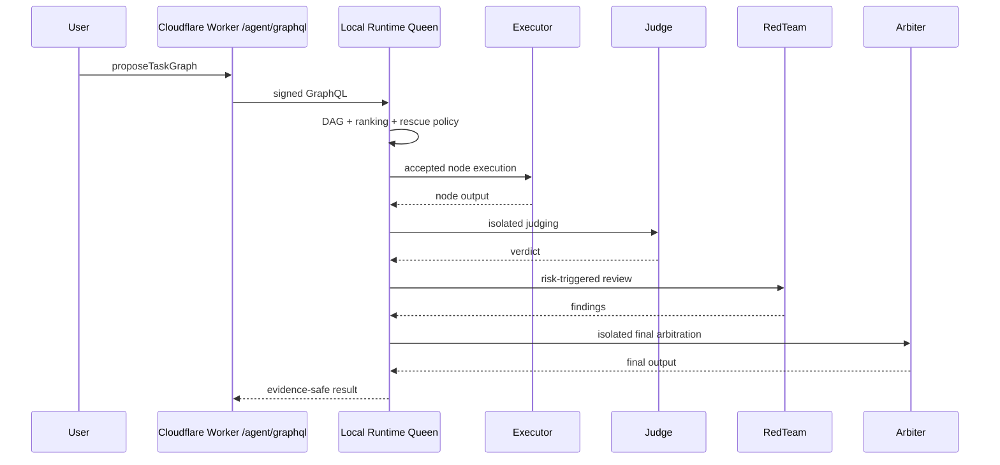

# Queen-led GraphQL Orchestration Implementation Plan

> **For agentic workers:** REQUIRED SUB-SKILL: Use superpowers:subagent-driven-development (recommended) or superpowers:executing-plans to implement this plan task-by-task. Steps use checkbox (`- [ ]`) syntax for tracking.

**Goal:** Build a GraphQL-enforced Queen-led multi-agent workflow where every real task is planned as a DAG, nodes are assigned to accepted agents, independent Judge and Final Arbiter agents gate quality, red-team/repair runs on risk, and Learning Loop evidence is recorded.

**Architecture:** Shared contracts define the GraphQL state machine, task graph, agent lifecycle, and evidence payloads. Cloudflare Worker remains the only public orchestration entry and forwards signed GraphQL bodies to the Local Runtime. The Local Runtime owns resolver execution, agent ranking, assignment acceptance, node execution, judge/final-arbiter isolation, red-team repair, and Learning Loop records.

**Tech Stack:** TypeScript, Zod, Vitest, React, Vite, Cloudflare Pages Worker, Local Agent Runner, existing provider API/Ollama adapters.

**Spec:** Chat-confirmed PRD in current conversation, locked after Q1-Q22.

## Global Constraints

- Documents requiring review are Chinese; GraphQL fields and TypeScript names remain English.
- GraphQL is the only orchestration entry for real tasks.
- Queen is an orchestrator/router/coordinator, not a final judge.
- Judge and Final Arbiter must be independent agents and cannot reuse the executor context.
- Agent selection defaults to Queen auto-selection; user override wins after risk confirmation, except safety hard bans.
- Every node assignment must reach `accepted` before the task can start.
- Low-risk tasks may auto-start; high-risk tasks require manual start.
- Repair/rescue policy is auto-added and user-invisible, but Evidence-visible.
- Cost-priority ranking must still enforce minimum capability and quality gates.
- User-added local/API models must be wrapped as Agent Manifest before assignment.
- Local Codex may be used only as private preview/demo Judge or Final Arbiter through Local Runtime, not as public production default.
- PII, keys, private prompts, raw logs, local paths, and model weights cannot enter public Evidence or external model prompts.
- Do not deploy or push unless the user explicitly asks.

---

## File Structure

- Create: `packages/shared-contracts/src/queen-orchestration.ts`
  - Owns Zod schemas and TypeScript types for task graph, lifecycle states, ranking, assignments, judge/red-team/final arbitration, Learning Loop, GraphQL request/response.
- Modify: `packages/shared-contracts/src/index.ts`
  - Exports Queen orchestration schemas and types.
- Create: `packages/shared-contracts/src/queen-orchestration.test.ts`
  - Contract tests for required stages, DAG shape, independent judge/final arbiter, accepted assignments, user override risk confirmation.
- Create: `apps/local-agent-runner/src/queen-ranking.ts`
  - Pure agent ranking policy: capability, cost, availability, latency, historical score, low-score淘汰, new-model protection, minimum quality line.
- Create: `apps/local-agent-runner/src/queen-ranking.test.ts`
  - Ranking behavior tests.
- Create: `apps/local-agent-runner/src/queen-orchestrator.ts`
  - Pure state-machine/resolver service for GraphQL mutations.
- Create: `apps/local-agent-runner/src/queen-orchestrator.test.ts`
  - Resolver/state-machine tests: propose graph, rank, select, accept, start, judge, red-team, repair, final arbitration, learning loop.
- Modify: `apps/local-agent-runner/src/stream-runtime.ts`
  - Route `/graphql` Queen mutations to `queen-orchestrator`; keep existing `orchestrateAgents` compatibility.
- Modify: `apps/local-agent-runner/src/stream-runtime.test.ts`
  - Add signed GraphQL tests for Queen mutation routing.
- Modify: `apps/web/src/pages-worker.ts`
  - Validate/forward Queen GraphQL requests through `/agent/graphql`; keep body limits, Turnstile, CORS, signing.
- Modify: `apps/web/src/pages-worker.test.ts`
  - Add Worker proxy tests for state-machine mutations and GraphQL errors.
- Modify: `apps/web/src/pages/LocalAgentsPage.tsx`
  - Add Queen workflow view, task graph stages, node assignments, user override risk confirmation, accepted/start states, judge/red-team/final result.
- Modify: `apps/web/src/styles.css`
  - Add DAG/status/risk/evidence UI styles.
- Modify: `apps/web/src/pages/EvidencePage.tsx`
  - Show Queen-led GraphQL workflow, full evidence chain, local Codex boundary.
- Modify: `docs/evidence/testing/2026-08-22-live-agent-validation.json`
  - Add Queen-led workflow contract/evidence fields.
- Optional create: `docs/architecture/queen-led-graphql-orchestration.mmd`
  - Mermaid architecture/sequence diagram if existing Evidence page needs a static diagram source.

---

### Task 1: Shared Queen GraphQL Contract

**Files:**
- Create: `packages/shared-contracts/src/queen-orchestration.ts`
- Modify: `packages/shared-contracts/src/index.ts`
- Test: `packages/shared-contracts/src/queen-orchestration.test.ts`

**Interfaces:**
- Produces:
  - `QueenGraphqlRequestSchema`
  - `TaskGraphSchema`
  - `TaskNodeSchema`
  - `TaskEdgeSchema`
  - `AgentCandidateSchema`
  - `NodeAssignmentSchema`
  - `QueenMutationNameSchema`
  - `QueenWorkflowEventSchema`
  - `type QueenGraphqlRequest`
  - `type TaskGraph`
  - `type TaskNode`
  - `type NodeAssignment`

- [ ] **Step 1: Write failing contract tests**

```ts
import { describe, expect, it } from "vitest";
import {
  QueenGraphqlRequestSchema,
  TaskGraphSchema,
  NodeAssignmentSchema,
} from "./queen-orchestration";

describe("Queen orchestration contracts", () => {
  it("accepts a DAG with mandatory plan, judge, repair, final arbitration, and deliver stages", () => {
    const graph = TaskGraphSchema.parse({
      taskId: "11111111-1111-4111-8111-111111111111",
      graphRevision: 1,
      requiredStages: ["requirement", "graph", "ranking", "acceptance", "execution", "judge", "final_arbitration", "delivery"],
      riskLevel: "low",
      startPolicy: "auto",
      nodes: [
        { nodeId: "plan-1", type: "plan", title: "Plan", dependencies: [], required: true },
        { nodeId: "execute-1", type: "execute", title: "Execute", dependencies: ["plan-1"], required: true },
        { nodeId: "judge-1", type: "judge", title: "Judge execute", dependencies: ["execute-1"], required: true, judgesNodeId: "execute-1" },
        { nodeId: "repair-1", type: "repair", title: "Repair fallback", dependencies: ["judge-1"], required: false, repairsNodeId: "execute-1" },
        { nodeId: "final-1", type: "synthesize", title: "Final arbitration", dependencies: ["judge-1"], required: true },
        { nodeId: "deliver-1", type: "deliver", title: "Deliver", dependencies: ["final-1"], required: true },
      ],
      edges: [
        { from: "plan-1", to: "execute-1" },
        { from: "execute-1", to: "judge-1" },
        { from: "judge-1", to: "repair-1", condition: "needs_revision" },
        { from: "judge-1", to: "final-1", condition: "approved" },
        { from: "final-1", to: "deliver-1" },
      ],
      rescuePolicy: { mode: "auto", visibleToUser: false, evidenceVisible: true },
    });

    expect(graph.nodes.some((node) => node.type === "plan")).toBe(true);
    expect(graph.nodes.some((node) => node.type === "deliver")).toBe(true);
  });

  it("requires accepted assignment state before execution", () => {
    const assignment = NodeAssignmentSchema.parse({
      nodeId: "execute-1",
      selectedAgentId: "qwen-qwen-plus",
      status: "accepted",
      selectedBy: "queen",
      acceptedAt: "2026-08-22T12:00:00.000Z",
    });

    expect(assignment.status).toBe("accepted");
  });

  it("accepts GraphQL state-machine mutations with input variables", () => {
    const request = QueenGraphqlRequestSchema.parse({
      query: "mutation ProposeTaskGraph($input: ProposeTaskGraphInput!) { proposeTaskGraph(input: $input) { taskId } }",
      operationName: "ProposeTaskGraph",
      variables: {
        input: {
          requestId: "22222222-2222-4222-8222-222222222222",
          requirement: "Build a verified agent workflow",
          queenAgentId: "queen-router-v1",
        },
      },
    });

    expect(request.operationName).toBe("ProposeTaskGraph");
  });
});
```

- [ ] **Step 2: Run red test**

Run: `pnpm --filter @agent-market/shared-contracts test -- --run packages/shared-contracts/src/queen-orchestration.test.ts`

Expected: FAIL because `queen-orchestration.ts` does not exist.

- [ ] **Step 3: Implement minimal schemas**

Create `queen-orchestration.ts` with Zod enums for:

```ts
WorkflowStage = "requirement" | "graph" | "ranking" | "acceptance" | "execution" | "judge" | "final_arbitration" | "delivery";
TaskNodeType = "plan" | "research" | "execute" | "critique" | "judge" | "red_team" | "repair" | "synthesize" | "deliver" | "custom";
RiskLevel = "low" | "medium" | "high";
StartPolicy = "auto" | "manualRequired";
AssignmentStatus = "candidate_ranked" | "selected" | "accepted" | "rejected" | "offline" | "timeout";
```

Implement strict schemas with bounded strings and arrays. Export all schemas and inferred types from `index.ts`.

- [ ] **Step 4: Run green test**

Run: `pnpm --filter @agent-market/shared-contracts test -- --run packages/shared-contracts/src/queen-orchestration.test.ts`

Expected: PASS.

---

### Task 2: Agent Ranking Policy

**Files:**
- Create: `apps/local-agent-runner/src/queen-ranking.ts`
- Test: `apps/local-agent-runner/src/queen-ranking.test.ts`

**Interfaces:**
- Consumes: `AgentManifest`, `AgentCandidate`
- Produces:
  - `rankAgentCandidates(input: RankAgentCandidatesInput): RankedAgentCandidate[]`
  - `isAgentEligible(candidate: AgentCandidate): boolean`

- [ ] **Step 1: Write failing ranking tests**

```ts
import { describe, expect, it } from "vitest";
import { rankAgentCandidates } from "./queen-ranking";

describe("queen agent ranking", () => {
  it("prioritizes lower cost after capability match and minimum quality", () => {
    const ranked = rankAgentCandidates({
      nodeType: "execute",
      requiredCapabilities: ["completion"],
      now: new Date("2026-08-22T12:00:00.000Z"),
      candidates: [
        candidate("expensive", { costPer1kTokensUsd: 0.02, qualityScore: 0.9 }),
        candidate("cheap", { costPer1kTokensUsd: 0.001, qualityScore: 0.82 }),
      ],
    });

    expect(ranked[0]?.agentId).toBe("cheap");
  });

  it("filters low-score old models even when they are cheap", () => {
    const ranked = rankAgentCandidates({
      nodeType: "execute",
      requiredCapabilities: ["completion"],
      now: new Date("2026-08-22T12:00:00.000Z"),
      candidates: [
        candidate("low-old", { costPer1kTokensUsd: 0, qualityScore: 0.31, firstSeenAt: "2026-01-01T00:00:00.000Z" }),
        candidate("ok", { costPer1kTokensUsd: 0.01, qualityScore: 0.75 }),
      ],
    });

    expect(ranked.map((item) => item.agentId)).toEqual(["ok"]);
  });

  it("gives a bounded protection boost to new models above the quality floor", () => {
    const ranked = rankAgentCandidates({
      nodeType: "execute",
      requiredCapabilities: ["completion"],
      now: new Date("2026-08-22T12:00:00.000Z"),
      candidates: [
        candidate("stable", { costPer1kTokensUsd: 0.004, qualityScore: 0.83, firstSeenAt: "2026-01-01T00:00:00.000Z" }),
        candidate("new", { costPer1kTokensUsd: 0.004, qualityScore: 0.78, firstSeenAt: "2026-08-22T00:00:00.000Z" }),
      ],
    });

    expect(ranked[0]?.agentId).toBe("new");
  });
});
```

- [ ] **Step 2: Run red test**

Run: `pnpm --filter @agent-market/local-agent-runner test -- --run apps/local-agent-runner/src/queen-ranking.test.ts`

Expected: FAIL because the module does not exist.

- [ ] **Step 3: Implement ranking**

Use deterministic scoring:

```ts
score = capabilityScore * 10000
  - normalizedCost * 1000
  + availabilityScore * 500
  - latencyPenalty
  + qualityScore * 100
  + newModelProtectionBoost;
```

Hard filters:

```ts
status !== "online" && status !== "degraded" -> reject
missing required capability -> reject
qualityScore < 0.45 and model age > 7 days -> reject
qualityScore < 0.35 always reject
```

Protection:

```ts
firstSeenAt within 7 days and qualityScore >= 0.7 -> +40 boost
```

- [ ] **Step 4: Run green test**

Run: `pnpm --filter @agent-market/local-agent-runner test -- --run apps/local-agent-runner/src/queen-ranking.test.ts`

Expected: PASS.

---

### Task 3: Pure Queen State Machine

**Files:**
- Create: `apps/local-agent-runner/src/queen-orchestrator.ts`
- Test: `apps/local-agent-runner/src/queen-orchestrator.test.ts`

**Interfaces:**
- Consumes: shared Queen contracts and `rankAgentCandidates`
- Produces:
  - `createQueenOrchestrator(options): QueenOrchestrator`
  - `QueenOrchestrator.handleGraphql(request): Promise<QueenGraphqlResponse>`

- [ ] **Step 1: Write failing state-machine tests**

Test behaviors:

```ts
it("proposes a DAG with hidden auto rescue policy");
it("ranks and auto-selects node agents using cost-priority ranking");
it("blocks start until every required node assignment is accepted");
it("requires manual start for high-risk tasks");
it("rejects judge self-review when judge equals executor or queen");
it("triggers red-team when judge returns a low score");
it("requires final arbiter to be independent from queen");
it("writes a redacted learning-loop record after final arbitration");
```

Use literal fixtures for expected statuses:

```ts
expect(result.data.startTaskRun.status).toBe("blocked");
expect(result.data.startTaskRun.reasonCode).toBe("ASSIGNMENT_NOT_ACCEPTED");
```

- [ ] **Step 2: Run red test**

Run: `pnpm --filter @agent-market/local-agent-runner test -- --run apps/local-agent-runner/src/queen-orchestrator.test.ts`

Expected: FAIL because the orchestrator does not exist.

- [ ] **Step 3: Implement in-memory orchestrator**

Implement a deterministic in-memory store scoped to runtime process:

```ts
tasks: Map<string, QueenTaskRecord>
events: QueenWorkflowEvent[]
learningRecords: LearningLoopRecord[]
```

P0 mutations:

```ts
proposeTaskGraph
rankNodeAgents
selectNodeAgent
acceptNodeAssignment
confirmTaskGraph
startTaskRun
submitNodeOutput
judgeNodeOutput
requestAdversarialReview
repairNode
finalArbitrate
writeLearningLoop
```

Keep execution pure in this task: no model calls yet. Return structured state and events.

- [ ] **Step 4: Run green test**

Run: `pnpm --filter @agent-market/local-agent-runner test -- --run apps/local-agent-runner/src/queen-orchestrator.test.ts`

Expected: PASS.

---

### Task 4: Runtime GraphQL Resolver Integration

**Files:**
- Modify: `apps/local-agent-runner/src/stream-runtime.ts`
- Modify: `apps/local-agent-runner/src/stream-runtime.test.ts`

**Interfaces:**
- Consumes: `createQueenOrchestrator`
- Produces: Signed `/graphql` support for both existing `orchestrateAgents` and Queen state-machine mutations.

- [ ] **Step 1: Write failing runtime route tests**

Add tests:

```ts
it("routes signed proposeTaskGraph GraphQL requests to Queen orchestrator");
it("rejects unsigned Queen GraphQL requests");
it("keeps existing orchestrateAgents mutation working");
```

Expected shape:

```ts
expect(payload.data.proposeTaskGraph.taskId).toMatch(/[0-9a-f-]{36}/);
expect(payload.data.proposeTaskGraph.rescuePolicy).toMatchObject({ mode: "auto", visibleToUser: false });
```

- [ ] **Step 2: Run red test**

Run: `pnpm --filter @agent-market/local-agent-runner test -- --run apps/local-agent-runner/src/stream-runtime.test.ts`

Expected: FAIL because Queen mutations are not routed.

- [ ] **Step 3: Implement route dispatch**

In `handleGraphqlOrchestration`, detect mutation name:

```ts
if (isQueenMutation(request.query, request.operationName)) {
  return Response.json(await queenOrchestrator.handleGraphql(request), { headers: { "cache-control": "no-store" } });
}
```

Keep `orchestrateAgents` as backward-compatible path.

- [ ] **Step 4: Run green test**

Run: `pnpm --filter @agent-market/local-agent-runner test -- --run apps/local-agent-runner/src/stream-runtime.test.ts`

Expected: PASS.

---

### Task 5: Worker GraphQL Boundary

**Files:**
- Modify: `apps/web/src/pages-worker.ts`
- Modify: `apps/web/src/pages-worker.test.ts`

**Interfaces:**
- Consumes: `QueenGraphqlRequestSchema`
- Produces: Public `/agent/graphql` that validates Queen requests, enforces origin/body limits, Turnstile, runtime config, and HMAC signing.

- [ ] **Step 1: Write failing Worker proxy tests**

Add tests:

```ts
it("validates and signs Queen GraphQL mutations to runtime /graphql");
it("returns GraphQL error when runtime is offline");
it("rejects oversized Queen GraphQL payloads");
```

Assert:

```ts
expect(new URL(calls[0]!.url).pathname).toBe("/graphql");
expect(calls[0]!.headers.get("x-agent-signature")).toMatch(/^[0-9a-f]{64}$/);
```

- [ ] **Step 2: Run red test**

Run: `pnpm --filter @agent-market/web test -- --run apps/web/src/pages-worker.test.ts`

Expected: FAIL if Queen schema is not accepted by Worker validation.

- [ ] **Step 3: Implement Worker validation**

Allow both:

```ts
LiveAgentGraphqlRequestSchema
QueenGraphqlRequestSchema
```

Reject any GraphQL operation that is neither existing `orchestrateAgents` nor an allowed Queen mutation.

- [ ] **Step 4: Run green test**

Run: `pnpm --filter @agent-market/web test -- --run apps/web/src/pages-worker.test.ts`

Expected: PASS.

---

### Task 6: Real Execution Hooks for Judge, Red Team, Repair, Final Arbiter

**Files:**
- Modify: `apps/local-agent-runner/src/queen-orchestrator.ts`
- Modify: `apps/local-agent-runner/src/queen-orchestrator.test.ts`
- Modify: `apps/local-agent-runner/src/stream-runtime.ts` if shared `executeAgentText` needs extraction.

**Interfaces:**
- Consumes existing Ollama/provider clients and manifests.
- Produces real model-backed execution for node outputs, judge verdicts, red-team findings, repair outputs, and final arbitration.

- [ ] **Step 1: Write failing real-execution tests with fake clients**

Test:

```ts
it("uses a different judge agent than the executor");
it("runs red-team after low judge score and creates a repair node");
it("uses an independent final arbiter agent for final output");
```

Use fake clients returning literal content:

```ts
"executor output"
"judge verdict: needs_revision score 0.52"
"red team finding: missing evidence"
"repair output"
"final approved output"
```

- [ ] **Step 2: Run red test**

Run: `pnpm --filter @agent-market/local-agent-runner test -- --run apps/local-agent-runner/src/queen-orchestrator.test.ts`

Expected: FAIL because model-backed execution is not wired.

- [ ] **Step 3: Implement execution helpers**

Extract or reuse:

```ts
executeAgentText({ manifest, messages, ollamaClient, providerClients, signal })
```

Add role-isolated prompts:

```ts
buildExecutorPrompt(node, requirement, priorOutputs)
buildJudgePrompt(node, executorOutput)
buildRedTeamPrompt(node, executorOutput, judgeVerdict)
buildRepairPrompt(node, redTeamFindings, judgeVerdict)
buildFinalArbiterPrompt(task, outputs, judgeVerdicts, redTeamFindings)
```

Independence checks:

```ts
judgeAgentId !== queenAgentId
judgeAgentId !== executorAgentId
finalArbiterAgentId !== queenAgentId
finalArbiterContextId !== executorContextId
```

- [ ] **Step 4: Run green test**

Run: `pnpm --filter @agent-market/local-agent-runner test -- --run apps/local-agent-runner/src/queen-orchestrator.test.ts`

Expected: PASS.

---

### Task 7: Queen Workflow UI

**Files:**
- Modify: `apps/web/src/pages/LocalAgentsPage.tsx`
- Modify: `apps/web/src/styles.css`
- Test: existing web tests; add component tests only if the project already has DOM test setup.

**Interfaces:**
- Consumes: `/agent/graphql` Queen mutations.
- Produces UI for requirement input, DAG stages, agent candidates, selected/accepted status, override risk confirmation, judge/red-team/repair/final arbitration, learning-loop/evidence summary.

- [ ] **Step 1: Add UI state tests if available**

If current test setup supports React DOM rendering, add:

```ts
it("does not show start enabled until required assignments are accepted");
it("shows risk confirmation before user override is submitted");
```

If no React DOM setup exists, keep this task covered by typecheck/build and runtime contract tests.

- [ ] **Step 2: Implement UI state model**

Add local state:

```ts
requirement
taskGraph
rankingsByNode
assignmentsByNode
taskRun
judgeResults
redTeamResults
repairResults
finalArbitration
learningLoop
overrideDialog
```

- [ ] **Step 3: Implement GraphQL client helpers**

Add typed helpers:

```ts
runQueenMutation<T>(operationName: string, query: string, input: unknown): Promise<T>
```

Use `/agent/graphql`; do not call runtime directly.

- [ ] **Step 4: Implement UX sequence**

Required UI states:

```text
Draft requirement
Graph proposed
Candidates ranked
Assignments selected
Assignments accepted
Ready to start
Running
Judging
Red-team / repair when triggered
Final arbitration
Learning loop written
Completed
```

User override:

```text
Click override -> show risk modal -> accept risk -> send SelectNodeAgent with riskNoticeAccepted=true
```

- [ ] **Step 5: Run checks**

Run: `pnpm --filter @agent-market/web test -- --run apps/web/src/pages-worker.test.ts`

Run: `pnpm --filter @agent-market/web typecheck`

Expected: PASS.

---

### Task 8: Evidence and Architecture Presentation

**Files:**
- Modify: `apps/web/src/pages/EvidencePage.tsx`
- Modify: `docs/evidence/testing/2026-08-22-live-agent-validation.json`
- Optional create: `docs/architecture/queen-led-graphql-orchestration.mmd`

**Interfaces:**
- Consumes task graph/evidence state.
- Produces a public-safe description of the full Queen-led GraphQL workflow.

- [ ] **Step 1: Update Evidence JSON**

Add:

```json
{
  "queenLedGraphqlWorkflow": {
    "status": "implemented",
    "entrypoint": "/agent/graphql",
    "requiredStages": ["requirement", "graph", "ranking", "acceptance", "execution", "judge", "final_arbitration", "delivery"],
    "redTeamPolicy": "risk-triggered",
    "rescuePolicy": "auto-added-user-invisible-evidence-visible",
    "localCodexBoundary": "private-preview-demo-only"
  }
}
```

- [ ] **Step 2: Update Evidence page copy**

Show:

```text
Queen 只编排，不终审。
Judge 独立验收节点。
Final Arbiter 独立终审。
GraphQL 是唯一编排入口。
补救节点自动补齐。
Learning Loop 写入脱敏摘要。
```

- [ ] **Step 3: Add diagram source**

If creating Mermaid:



- [ ] **Step 4: Run Evidence checks**

Run: `pnpm verify`

Expected: PASS.

---

### Task 9: Final Verification

**Files:**
- No new files unless verification exposes a defect.

**Interfaces:**
- Produces current proof that the feature is locally safe to preview.

- [ ] **Step 1: Run package-level checks**

Run:

```bash
pnpm --filter @agent-market/shared-contracts test
pnpm --filter @agent-market/local-agent-runner test
pnpm --filter @agent-market/web test
pnpm --filter @agent-market/web typecheck
```

Expected: all PASS.

- [ ] **Step 2: Run repository gate**

Run:

```bash
pnpm verify
```

Expected: PASS.

- [ ] **Step 3: Report without deploying**

Report:

```text
changed files
implemented GraphQL mutations
verified tests
local Codex boundary status
remaining preview/production pending items
```

No push and no deployment unless the user explicitly asks.

---

## Self-Review

Spec coverage:

- Queen-led 主从架构: Task 3, Task 7, Task 8.
- Router 难度/风险/成本: Task 2, Task 3.
- GraphQL 唯一入口: Task 1, Task 4, Task 5.
- DAG 图排: Task 1, Task 3, Task 7.
- Agent 选择/接单: Task 1, Task 3, Task 7.
- Judge 独立裁判: Task 1, Task 3, Task 6.
- Final Arbiter 独立终审: Task 1, Task 3, Task 6.
- Red-team 对抗: Task 1, Task 3, Task 6.
- Repair 自动补救: Task 1, Task 3, Task 6.
- Learning Loop: Task 1, Task 3, Task 8.
- Evidence 完整链路: Task 8.
- 本地 Codex preview/demo 边界: Task 1, Task 6, Task 8.
- PII 出站边界: Global Constraints, Task 6, Task 8.

No placeholders remain. Type names used by later tasks are introduced in earlier tasks.
