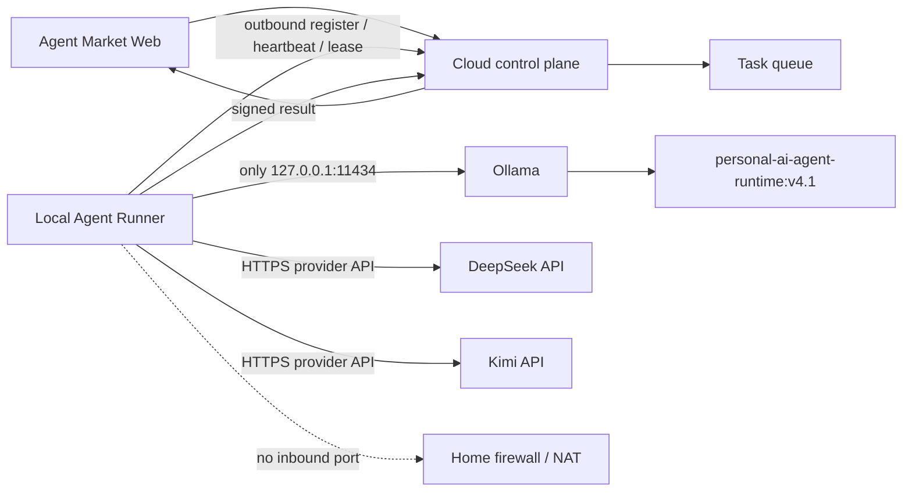
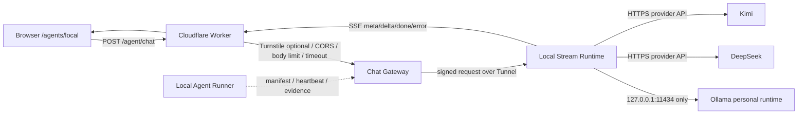

# Agent Market 本地 Ollama Agent 设计

日期：2026-08-22

Contract：`fa5a111210eb5988d869e986d57c20ee673fe5c833729dd00b8302c40b062974`

## 1. 决策

采用用户确认的 C 方案：同步聊天数据面使用 Cloudflare Worker + Tunnel + Local Stream Runtime，异步控制面保留 Local Agent Runner。Agent Market 不让浏览器访问 Ollama、provider key、文件系统或终端。默认执行者是 `personal-ai-agent-runtime:v4.1`；DeepSeek、Kimi、Qwen 与 Zhipu 作为 `third-party/provider-api` Agent 接入。

## 2. 架构

V1 live chat 数据面：

权威边界：

- 云端控制面负责 Agent 状态、任务 lease、结果状态和前端查询。
- Worker 负责公开入口、访问校验、输入限制、CORS、Turnstile、Runtime 签名和统一错误码。
- Local Stream Runtime 负责真实同步聊天，不开放文件、终端、工具执行和本地资料原文。
- runner 负责模型发现、并发、超时、取消、幂等、签名和安全日志。
- Ollama 只负责本地模型推理，不直接理解 Agent Market 任务或注册协议。
- DeepSeek/Kimi/Qwen/Zhipu 只作为第三方托管推理 provider；API key 只在 runner 环境中读取，不进入 Web 或 Evidence。
- Web 只读取控制面状态；静态 Evidence 只展示最近一次脱敏验证快照。

## 3. 默认模型与身份

| 字段 | 值 |
| --- | --- |
| Agent ID | `personal-ai-agent-runtime-v4-1` |
| Ownership | `owner-trained` |
| Provider | `ollama` |
| Model tag | `personal-ai-agent-runtime:v4.1` |
| Digest | `2c422ec890241b8492e08d4ba69f79f25efcf8ae4220e83797d2df9cbc7eb52a` |
| Parent | `personal-ai-agent:v4.1` |
| Family | `qwen3` |
| Size | `8.2B` |
| Quantization | `Q4_K_M` |
| Context | `40960` |
| Capabilities | completion、thinking、tools |

第三方模型必须使用 `third-party/local-served`。来源、License 或 metadata 缺失时显示 pending，不推断、不补写。

DeepSeek/Kimi/Qwen/Zhipu 必须使用 `third-party/provider-api`。没有 provider weight digest 时使用 `provider-managed`，并把 provider、模型 ID、base URL 来源和 Terms 状态写清楚。

## 4. 编号请求流

1. runner 校验配置，只接受 loopback Ollama origin 和 HTTPS/测试 localhost 控制面。
2. runner 调用 `/api/tags`，从 allowlist 过滤已安装模型。
3. runner 调用 `/api/show`，构造 Agent Manifest，embedding-only 模型被排除。
4. runner 对 manifest body 做 SHA-256，并用 timestamp、nonce、key id 生成 HMAC 签名。
5. 控制面验签、拒绝重放并幂等登记 Agent。
6. runner 按间隔发送 heartbeat 并请求下一条 lease。
7. lease 绑定 request_id、run_id、task_id、agent_id、model tag/digest 和截止时间。
8. runner 在并发/超时限制内调用 Ollama；取消信号中止 fetch。
9. provider API Agent 在同一并发/超时/取消边界内调用 DeepSeek/Kimi/Qwen/Zhipu OpenAI-compatible endpoint。
10. runner 对结果签名回传；重复 lease 返回原有终态，不重复推理。
11. heartbeat 超时后控制面标记 offline；主站继续运行，不伪造 fallback 成功。

## 5. 模块边界

### Shared contracts

Zod schema 冻结 manifest、lease、result、签名 header、live chat request、SSE event、health 和错误码。该包不执行网络和密钥操作，因此可被 Web、runner、Runtime 和未来控制面共同使用。

### Local Agent Runner

- `config`：校验 origin、allowlist、并发、timeout 和 payload 上限。
- `ollama-client`：发现 metadata 与执行 chat；只接受 loopback。
- `provider-api-client`：读取 DeepSeek/Kimi/Qwen/Zhipu 环境变量，调用 OpenAI-compatible chat completions，并输出 provider-managed manifest。
- `stream-runtime`：验证 Worker 签名，按 manifest 执行本地 Ollama streaming 或 provider API 调用，输出 SSE。
- `signing`：body hash、HMAC、nonce/replay verifier。
- `control-plane-client`：注册、heartbeat、lease 和 result HTTP。
- `runner`：调度、幂等、取消、退避、优雅停止和安全事件日志。

### Web

新增 `/agents/local`。页面采用 Mastra-style playground，从 `/agent/healthz` 获取真实状态，通过 `/agent/chat` 发起 SSE 对话；不请求 localhost、不接触 provider key、不把静态 snapshot 显示为实时 online。

### Worker/Tunnel

- `/agent/healthz`：代理 Runtime health；Runtime 未配置时返回 `offline/RUNTIME_OFFLINE`。
- `/agent/chat`：校验 origin、字节上限、可选 Turnstile，签名后转发到 Runtime，并把 SSE 流返回浏览器。
- Tunnel 只映射到本地 Runtime 端口；`11434` 不被映射。

### Evidence

新增 Mermaid/SVG 架构与时序、manifest 快照、mock 集成结果和真实 smoke JSON。验证器阻止私有路径、凭据、缺 digest、错误 ownership 与假云端完成状态进入公开构建。

## 6. 失败与降级

| 失败 | 行为 | 状态 |
| --- | --- | --- |
| Ollama 未启动 | 注册/heartbeat 不伪造成功，runner 退避 | offline |
| 默认模型缺失 | 不 pull，manifest 标记不可用 | offline |
| 控制面不可用 | 本地模型不受损，任务不执行，指数退避 | pending-cloud/degraded |
| Runtime/Tunnel 未配置 | 页面仍可打开，chat 返回 SSE error | offline |
| Worker 签名失败 | Runtime 拒绝请求 | unauthorized |
| Provider key 缺失 | provider agent 标记 offline，不伪造可用 | offline |
| lease 重复 | 返回缓存终态，不再次推理 | idempotent |
| 模型超时/取消 | 中止调用，签名回传失败码 | failed/cancelled |
| 签名过期或 nonce 重放 | 控制面拒绝 | unauthorized/replay |
| 第三方 metadata 不全 | 可发现但不宣称已验证 | pending metadata |

## 7. 测试策略

1. 协议 schema 与 ownership 规则测试。
2. loopback、安全签名、重放、payload 和日志脱敏测试。
3. mock Ollama 的发现、推理、超时和取消测试。
4. mock control plane 的 online→task→result、重复 lease 和 offline 测试。
5. live chat request/SSE/health schema、Runtime 验签、Worker proxy 和 UI route 测试。
6. 仅调用已安装的 `personal-ai-agent-runtime:v4.1` 做一次真实 smoke。
7. DeepSeek/Kimi/Qwen/Zhipu provider API 做一次短 prompt smoke；只保留脱敏摘要。
8. Web 路由、双语、SSR、响应式、公开内容扫描和完整仓库 Gate。

## 9. 多 agent 报名与仲裁流程

1. A 报名：纯 outbound runner + control plane。优点是无 Tunnel、入站面最小；缺点是 V1 只能异步最终文本，不适合真实流式聊天。
2. B 报名：Worker + Tunnel + Local Runtime。优点是真 SSE；缺点是新增公网数据面，Tunnel 不能当授权边界。
3. C 报名：短期采用 B 的同步数据面，同时保留 A 的 identity/heartbeat/lease/evidence 控制面。
4. 仲裁：V1 选 C。A 保留为二期“无 Tunnel 异步降级”，B 合并为 C 的 live chat 数据面。
5. Gate：所有请求必须通过 Worker；Runtime 必须验签；Ollama 只允许 loopback；provider key 只在服务端环境；Evidence 不记录 key、私有路径、完整敏感 prompt 或模型权重。

## 8. 状态边界

- `verified-local`：协议测试、mock 闭环或真实本机 smoke 有当前证据。
- `implemented`：代码存在并通过本地测试，但没有外部运行证据。
- `pending-cloud`：云端持久控制面、凭据签发和线上 heartbeat 未部署。
- `planned`：cloud provider fallback。
- `manual-pending`：生产发布。

## 2026-08-22 Provider smoke 状态补充

- `personal-ai-agent-runtime:v4.1`：已通过 signed local runtime smoke，状态 `verified`。
- `deepseek-v4-flash`：已通过 provider API smoke，状态 `verified`。
- `qwen-plus`：已通过 Alibaba Cloud Model Studio / DashScope OpenAI-compatible provider smoke，状态 `verified`。
- `kimi-k2.7-code`：已通过 Moonshot China endpoint (`https://api.moonshot.cn/v1`) provider smoke，状态 `verified`；原 `.ai` endpoint 对当前 key 返回认证失败，不能继续作为默认端点。
- `kimi-k3`、`kimi-k2.6`、`kimi-k2.7-code-highspeed`：已从 provider catalog 发现并可注册，但当前 Agent Market 只验证了 `kimi-k2.7-code` 的 clean smoke，其他 Kimi 模型保持 `pending-smoke`。
- `glm-5.3`：已通过 Z.AI / Zhipu OpenAI-compatible provider smoke，状态 `verified`。
