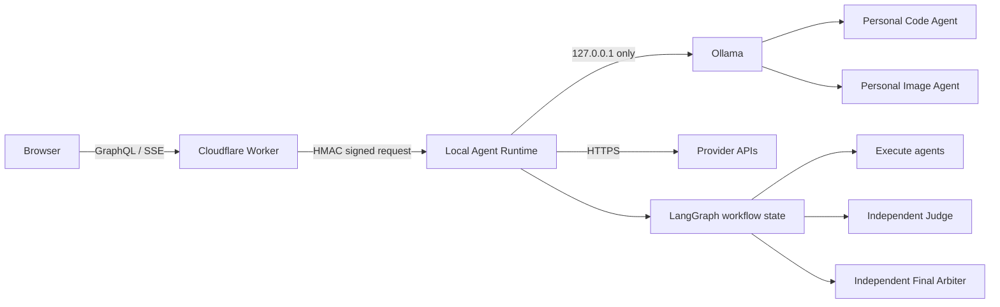
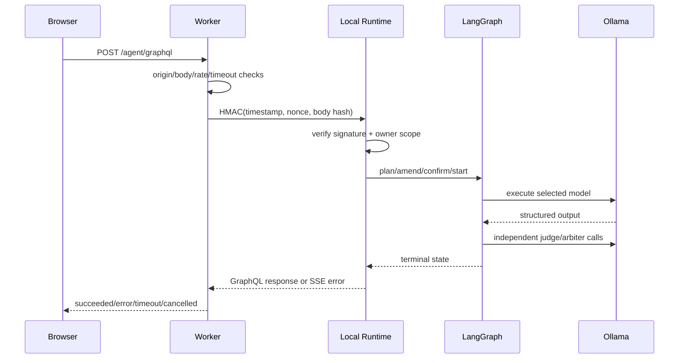

# Agent Market 真实 Agent 闭环设计

日期：2026-08-26

Contract：`00075d144ad64bfdb2c407cea849b56e1693a6c6abb765715de7d6368d0c790c`（v4）

## 1. 决策

沿用现有混合边界：浏览器只访问 Cloudflare Worker；Worker 对 Runtime 请求签名；Local Runtime 只在服务端调用 loopback Ollama 或 Provider API。多 Agent 编排继续使用纯 LangGraph 状态图，LangChain 仅作为需要时的节点内适配器，不使用 Mastra。

## 2. 系统架构

Evidence 不出现在业务图中。运行后由测试与运行台账旁路生成脱敏 Evidence。

## 3. 请求时序

## 4. 组件边界

- `model-registry.ts`：精确发现 tag/digest，构造 owner-trained manifest，不启动、不拉取模型。
- `stream-runtime.ts`：验证 HMAC、caller scope、请求上限和超时，调用本地或 Provider Agent。
- `queen-orchestrator.ts`：维护 LangGraph 状态机、节点合同、独立 Judge/Final Arbiter、补救和终态。
- `LocalAgentsPage.tsx`：展示工作流版本、活动节点、终态、取消与安全错误，不推断成功。
- `pages-worker.ts`：公开入口、统一超时、签名转发和离线降级。
- `EvidencePage.tsx`：只读取脱敏静态台账；不充当工作流节点。

## 5. 失败路由

| 条件 | 路由 |
| --- | --- |
| 公共 scope 选择本地 Agent | `FORBIDDEN`，不调用 Ollama |
| tag/digest 不匹配 | `MODEL_IDENTITY_MISMATCH`，状态保持 pending-smoke |
| Provider 失败 | `error`，可进入 Repair，不冒充成功 |
| Runtime 截止 | `timeout`，AbortSignal 传播到模型请求 |
| 用户取消 | `cancelled`，停止后续节点 |
| Judge 未通过 | 进入版本化 Repair；再次 Judge 后才能仲裁 |
| Final Arbiter 失败 | 整体 `error`，不生成成功交付 |

## 6. 测试设计

1. Registry 合同：两个模型 tag/digest/ownership/capabilities 精确匹配。
2. Runtime 合同：签名成功、重放拒绝、Owner scope 成功、public scope 拒绝。
3. GraphQL 合同：成功、Provider 失败、超时、取消与重复请求幂等。
4. 独立性 Gate：Execute/Judge/Final Arbiter 不得自审，同模型不得重复占位。
5. 真实 smoke：只调用已安装模型，短 Prompt、结构化输出、脱敏记录。
6. Web Gate：终态可见、取消可用、离线诚实、中文/英文完整。
7. 公共内容 Gate：禁止密钥、私有路径、`11434`、权重路径和完整私有 Prompt。

## 7. 状态升级

- `model-ready`：模型训练与 Ollama artifact 已在来源项目验收。
- `am-pending-smoke`：Agent Market 有 manifest/route，但未通过本项目签名 smoke。
- `verified-local`：本项目精确 identity + signed Runtime smoke 通过。
- `preview-verified`：Preview 公开页面与安全边界回读通过。
- `production-manual-pending`：没有新的生产授权或生产回读。
